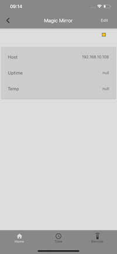
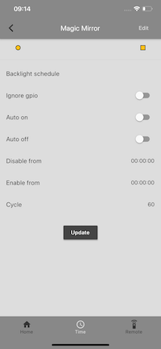
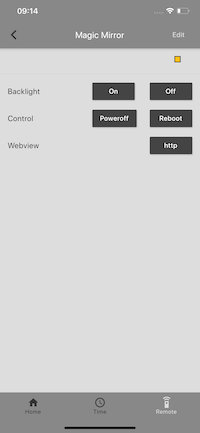
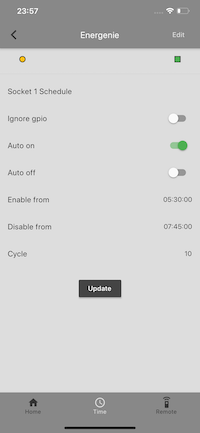
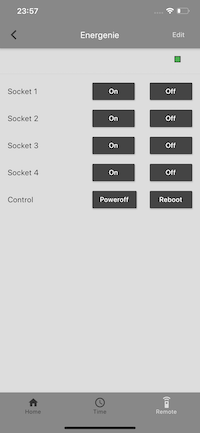

# Styra
An open source iOS and Android app built with Flutter
for controlling raspberry pi´s with  
[Magic Mirror](https://magicmirror.builders/)
and remote controlled  
[Energenie sockets](https://energenie4u.co.uk/catalogue/product/ENER002-2PI-EUR)

### Magic  

Schedule the backlight on and off or control it directly  

View the running magic mirror on the device directly in the app  

### Energenie
Schedule socket 1 on and off or control the sockets manually  

# Firebase
You need to setup a Firebase account.  
Add google-service.json to android/app if you have an android device

Add  GoogleService-info.plist to ios/Runner if you have iOS device

# Raspberry Pi
In order to have any use of this app, you need to get your hands on a rpi and follow the instructions over at the companion [repo](https://github.com/rosenberg-c/rpi_styra)
